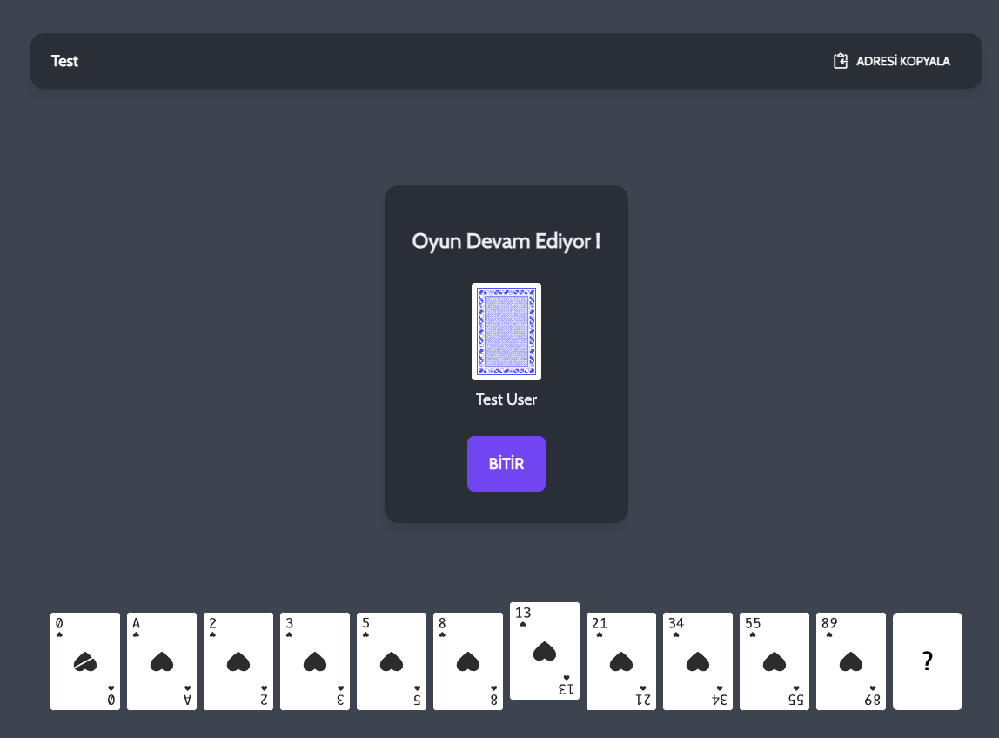

# Welcome to Scrum Batak 👋
[](https://twitter.com/mCelal)

> Scrum planning game

### 🏠 [Homepage](https://github.com/mcelal/planning-batak/)

### ✨ [Demo](https://batak.mcelal.dev/)



## Installation

Install Front-End

```sh
yarn install
```

Install SocketIO Server

```sh
cd /server
yarn install
```

Change .env files
```
cp .env-example .env
cd /server
cp .env-example .env
```

## Usage

Start Vue project

```sh
yarn run serve
```

Start SockerIO server
```
cd /server
node server.js
```

## Author

👤 **Mehmet Celal Kara**

* Website: https://www.mcelal.com
* Twitter: [@mCelal](https://twitter.com/mCelal)
* Github: [@mcelal](https://github.com/mcelal)
* LinkedIn: [@mcelal](https://linkedin.com/in/mcelal)

## 🤝 Contributing

Contributions, issues and feature requests are welcome!

Feel free to check [issues page](https://github.com/mcelal/planning-batak/issues). 

## Show your support

Give a ⭐️ if this project helped you!


***
_This README was generated with ❤️ by [readme-md-generator](https://github.com/kefranabg/readme-md-generator)_
